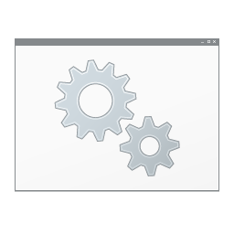
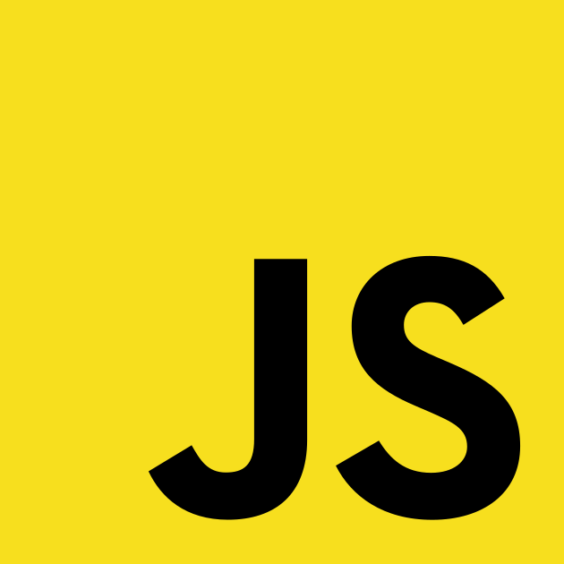

# anic17

Hi, it's Andreu, aka anic17, a Mathematics & Computer Science student at the Universitat Politècnica de Catalunya. Started as a hobbyist programmer, most of the projects and software you will find in my GitHub are mainly written in C, and the older ones in batch. I have also done a bit of frameworkless web development using HTML5, CSS3 and pure JavaScript.

# Skills
These are my skills and my frequently used languages.
 
 <table align="center">
 <tr>
  <td> 
Batch</p</td><td>  
C
</td><td>  
HTML5</p</td><td>  
CSS3</p</td><td>  
JS</p</td><td>  
Python</p</td><td>  
PSQL</p</td>
 </tr>
 </table>

 
# What I am working on

I'm currently working on <a style="text-decoration: none" href="https://github.com/anic17/Newtrodit">**Newtrodit**</a>, a console text editor written in C. Newtrodit 0.6 rc-1 is out, go try it! All feedback is appreciated.
Nevertheless, be sure to check out my <a href="https://anic17.github.io">other projects</a>! My website gets new pages and contains everything you need to use my programs.

# My GitHub stats

  

 

 

# Contact me

## These are the ways to reach me

### Discord
  My Discord server **[Program Dream](https://discord.gg/gfmaxgE)**

### Email
* **[SWH.Console@gmail.com](mailto:SWH.Console@gmail.com)** (main email)
* **[Batch.Antivirus@gmail.com](mailto:Batch.Antivirus@gmail.com)**  (only for Batch-Antivirus related topics)
* **[newtrodit@gmail.com](mailto:newtrodit@gmail.com)**  (only for Newtrodit related topics)

 

   
# Licensing and crediting

All my programs are licensed under the GNU GPL v3.0 (unless otherwise noted), meaning you are free to use and share them. I only ask that you credit me and include a **visible** link to the relevant GitHub repository in your project, preferrably on your README file.
